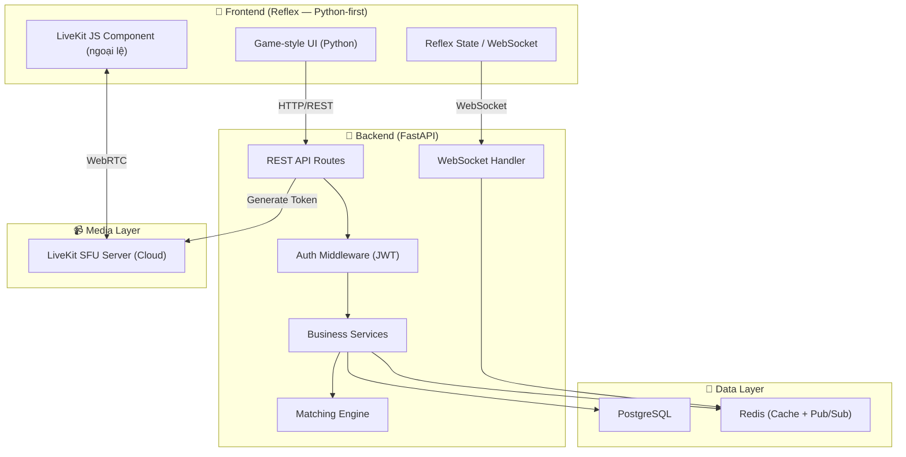
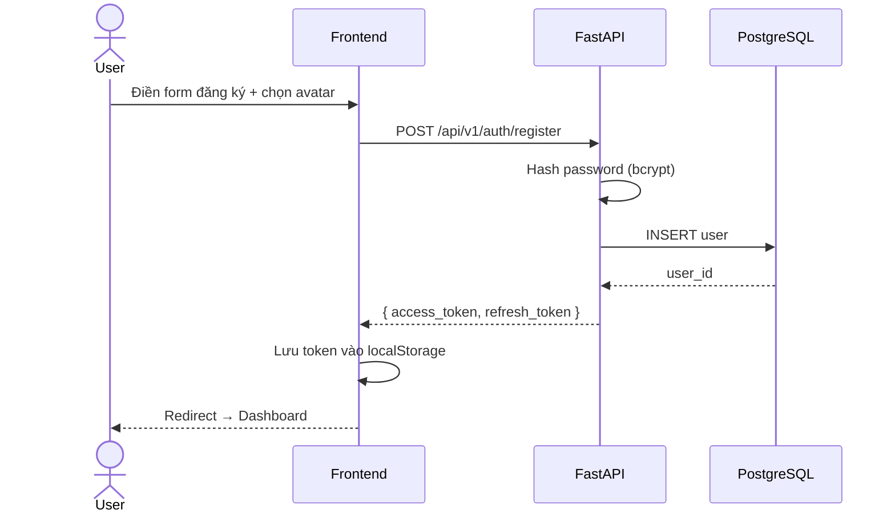
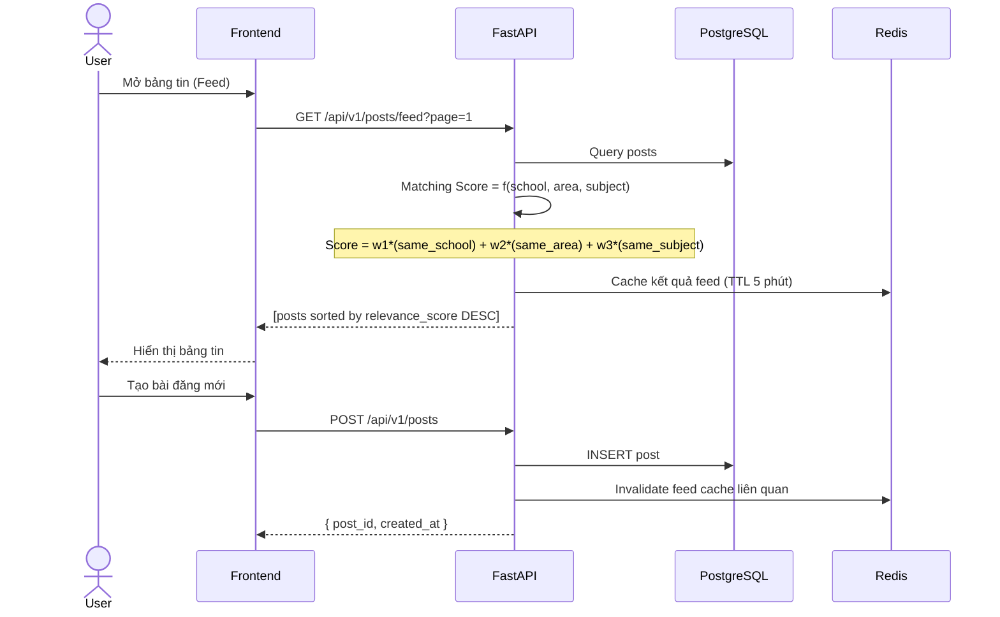
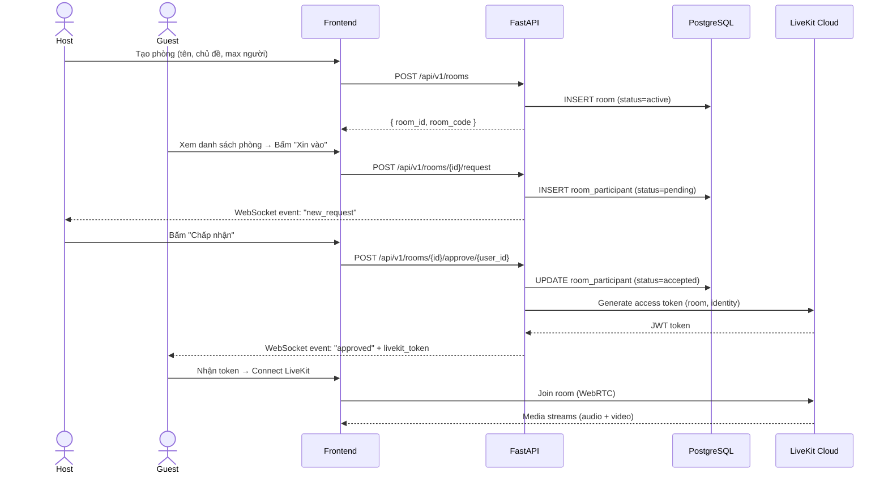
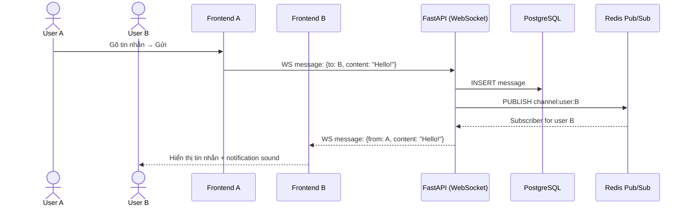
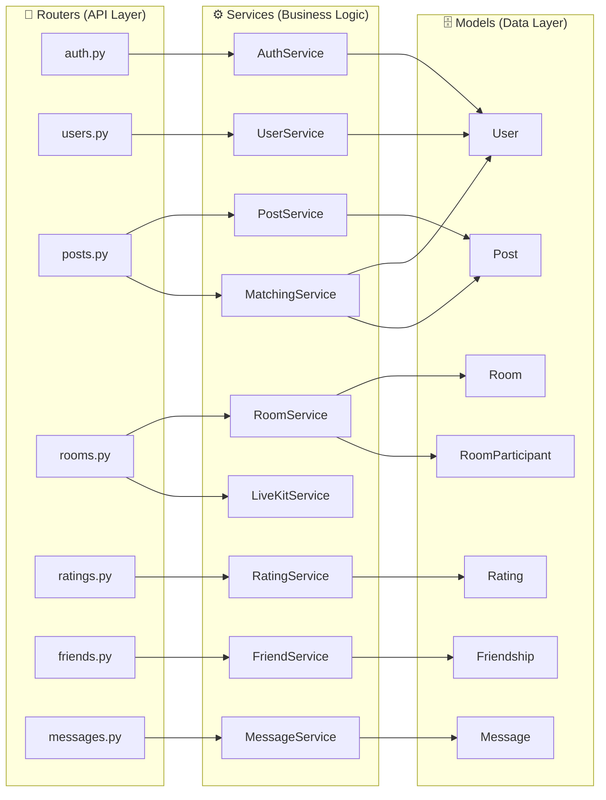
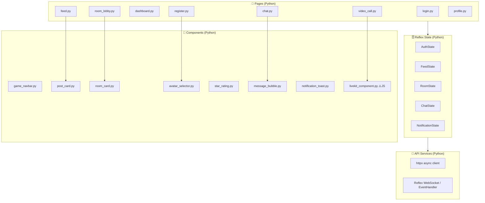

# Kiến Trúc Hệ Thống — StudyBuddy

## 1. Kiến trúc tổng quan (High-Level Architecture)



---

## 2. Luồng dữ liệu chính (Data Flow)

### 2.1. Đăng ký & Đăng nhập



### 2.2. Bảng tin & Matching Algorithm



### 2.3. Tạo phòng & Video Call



### 2.4. Nhắn tin riêng (Real-time Chat)



---

## 3. Thiết kế module Backend



---

## 4. Thiết kế module Frontend



---

## 5. Chiến lược Matching Algorithm

Thuật toán đẩy bài đăng/phòng phù hợp tới user dựa trên **điểm tương đồng (Relevance Score)**:

```
relevance_score(user, post) = 
    w1 * same_school(user, post.author)      // 0 hoặc 1, weight = 3.0
  + w2 * same_area(user, post.author)        // 0 hoặc 1, weight = 2.0  
  + w3 * subject_overlap(user, post)         // 0.0 → 1.0, weight = 2.5
  + w4 * recency_decay(post.created_at)      // 0.0 → 1.0, weight = 1.0
  + w5 * author_rating(post.author)          // 0.0 → 1.0, weight = 1.5
```

| Factor | Giải thích | Weight |
|--------|-----------|--------|
| `same_school` | Cùng trường → 1, khác → 0 | 3.0 |
| `same_area` | Cùng khu vực (quận/thành phố) → 1 | 2.0 |
| `subject_overlap` | % môn học chung (dựa trên tags) | 2.5 |
| `recency_decay` | Bài mới hơn được ưu tiên, decay theo giờ | 1.0 |
| `author_rating` | Rating trung bình của author / 5 | 1.5 |

Sắp xếp kết quả theo `relevance_score DESC`, phân trang 20 bài/trang.

---

## 6. Bảo mật (Security)

- **Authentication**: JWT Access Token (15 phút) + Refresh Token (7 ngày)
- **Password**: Hash bằng bcrypt, salt rounds = 12
- **API Protection**: Tất cả endpoint (trừ auth) yêu cầu Bearer token
- **WebSocket Auth**: Gửi token trong message đầu tiên khi connect
- **LiveKit Token**: Server-side generation, TTL = thời gian session
- **CORS**: Chỉ allow origin từ frontend domain
- **Rate Limiting**: slowapi, 60 req/phút cho API thường, 5 req/phút cho auth
- **Input Validation**: Pydantic v2 validate mọi input, bleach sanitize text content
- **File Upload**: Validate file type + size (max 5MB cho student ID, 10MB cho CV)

---

## 7. Scalability Notes

Ở giai đoạn MVP, hệ thống chạy trên **single server** (Docker Compose) là đủ. Khi scale:

1. **Database**: Thêm read replica cho PostgreSQL
2. **WebSocket**: Chuyển sang Redis Pub/Sub để scale horizontal
3. **Video Call**: LiveKit Cloud tự scale, không cần lo
4. **Cache**: Redis cluster
5. **Backend**: Chạy nhiều FastAPI instances sau Nginx load balancer
