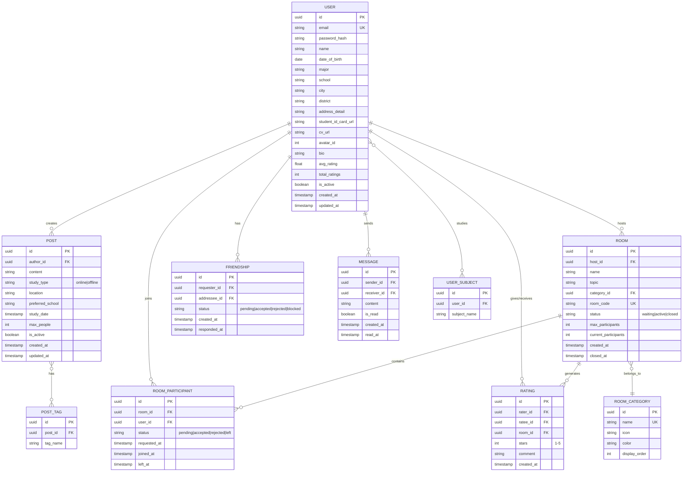

# Database Schema — forfriend

## 1. Entity Relationship Diagram



---

## 2. Chi tiết từng bảng

### 2.1. `user`

| Column | Type | Constraints | Mô tả |
|--------|------|------------|--------|
| `id` | UUID | PK, default uuid4 | |
| `email` | VARCHAR(255) | UNIQUE, NOT NULL | Email đăng nhập |
| `password_hash` | VARCHAR(255) | NOT NULL | Bcrypt hash |
| `name` | VARCHAR(100) | NOT NULL | Tên hiển thị |
| `date_of_birth` | DATE | NOT NULL | Năm sinh |
| `major` | VARCHAR(100) | NOT NULL | Ngành học |
| `school` | VARCHAR(200) | NOT NULL | Trường |
| `city` | VARCHAR(100) | NOT NULL | Thành phố |
| `district` | VARCHAR(100) | | Quận/Huyện |
| `address_detail` | TEXT | | Địa chỉ chi tiết |
| `student_id_card_url` | VARCHAR(500) | | URL ảnh thẻ sinh viên |
| `cv_url` | VARCHAR(500) | | URL file CV |
| `avatar_id` | INTEGER | NOT NULL, default 1 | ID avatar chibi (1–15) |
| `bio` | TEXT | | Giới thiệu bản thân |
| `avg_rating` | FLOAT | default 0.0 | Rating trung bình (denormalized) |
| `total_ratings` | INTEGER | default 0 | Tổng lượt đánh giá |
| `is_active` | BOOLEAN | default true | Tài khoản còn active? |
| `created_at` | TIMESTAMP | default now() | |
| `updated_at` | TIMESTAMP | on update | |

**Indexes:**
- `idx_user_school` on (`school`)
- `idx_user_city` on (`city`)
- `idx_user_major` on (`major`)

---

### 2.2. `user_subject`

| Column | Type | Constraints | Mô tả |
|--------|------|------------|--------|
| `id` | UUID | PK | |
| `user_id` | UUID | FK → user.id, NOT NULL | |
| `subject_name` | VARCHAR(100) | NOT NULL | Tên môn học (ví dụ: "Giải tích 1") |

**Indexes:**
- `idx_user_subject_user` on (`user_id`)
- UNIQUE constraint on (`user_id`, `subject_name`)

---

### 2.3. `post`

| Column | Type | Constraints | Mô tả |
|--------|------|------------|--------|
| `id` | UUID | PK | |
| `author_id` | UUID | FK → user.id, NOT NULL | |
| `content` | TEXT | NOT NULL | Nội dung bài đăng |
| `study_type` | VARCHAR(10) | NOT NULL, "online" or "offline" | Loại học |
| `location` | VARCHAR(200) | | Địa điểm (cho offline) |
| `preferred_school` | VARCHAR(200) | | Ưu tiên trường nào |
| `study_date` | TIMESTAMP | | Thời gian muốn học |
| `max_people` | INTEGER | default 5 | Tối đa bao nhiêu người |
| `is_active` | BOOLEAN | default true | Bài còn hiệu lực? |
| `created_at` | TIMESTAMP | default now() | |
| `updated_at` | TIMESTAMP | on update | |

**Indexes:**
- `idx_post_author` on (`author_id`)
- `idx_post_created` on (`created_at` DESC)
- `idx_post_active` on (`is_active`, `created_at` DESC)

---

### 2.4. `post_tag`

| Column | Type | Constraints | Mô tả |
|--------|------|------------|--------|
| `id` | UUID | PK | |
| `post_id` | UUID | FK → post.id, NOT NULL, ON DELETE CASCADE | |
| `tag_name` | VARCHAR(50) | NOT NULL | Tag: "toan", "lap-trinh", "ielts"... |

**Indexes:**
- `idx_post_tag_post` on (`post_id`)
- `idx_post_tag_name` on (`tag_name`)

---

### 2.5. `room`

| Column | Type | Constraints | Mô tả |
|--------|------|------------|--------|
| `id` | UUID | PK | |
| `host_id` | UUID | FK → user.id, NOT NULL | Người tạo phòng |
| `name` | VARCHAR(100) | NOT NULL | Tên phòng |
| `topic` | VARCHAR(200) | NOT NULL | Chủ đề phòng |
| `category_id` | UUID | FK → room_category.id | Khu vực phân loại |
| `room_code` | VARCHAR(10) | UNIQUE, NOT NULL | Mã phòng ngắn |
| `status` | VARCHAR(20) | NOT NULL, default "waiting" | waiting → active → closed |
| `max_participants` | INTEGER | NOT NULL, default 10 | Giới hạn người |
| `current_participants` | INTEGER | default 1 | Số người hiện tại (denormalized) |
| `created_at` | TIMESTAMP | default now() | |
| `closed_at` | TIMESTAMP | | Khi phòng đóng |

**Indexes:**
- `idx_room_host` on (`host_id`)
- `idx_room_category` on (`category_id`)
- `idx_room_status` on (`status`, `created_at` DESC)
- `idx_room_code` on (`room_code`)

---

### 2.6. `room_category`

| Column | Type | Constraints | Mô tả |
|--------|------|------------|--------|
| `id` | UUID | PK | |
| `name` | VARCHAR(50) | UNIQUE, NOT NULL | "Toán học", "Lập trình", "Ngoại ngữ"... |
| `icon` | VARCHAR(10) | | Emoji hoặc icon code |
| `color` | VARCHAR(7) | | Hex color cho UI |
| `display_order` | INTEGER | default 0 | Thứ tự hiển thị |

**Seed data:**

| name | icon | color |
|------|------|-------|
| Toán học | 📐 | #FF6B6B |
| Lập trình | 💻 | #4ECDC4 |
| Ngoại ngữ | 🌍 | #45B7D1 |
| Khoa học tự nhiên | 🔬 | #96CEB4 |
| Kinh tế | 📊 | #FECA57 |
| Y - Dược | ⚕️ | #FF9FF3 |
| Luật | ⚖️ | #54A0FF |
| Kỹ thuật | ⚙️ | #5F27CD |
| Nghệ thuật | 🎨 | #FF6348 |
| Khác | 📚 | #A0A0A0 |

---

### 2.7. `room_participant`

| Column | Type | Constraints | Mô tả |
|--------|------|------------|--------|
| `id` | UUID | PK | |
| `room_id` | UUID | FK → room.id, NOT NULL | |
| `user_id` | UUID | FK → user.id, NOT NULL | |
| `status` | VARCHAR(20) | NOT NULL, default "pending" | pending → accepted/rejected/left |
| `requested_at` | TIMESTAMP | default now() | |
| `joined_at` | TIMESTAMP | | Khi được accept |
| `left_at` | TIMESTAMP | | Khi rời phòng |

**Indexes:**
- `idx_rp_room` on (`room_id`, `status`)
- `idx_rp_user` on (`user_id`)
- UNIQUE constraint on (`room_id`, `user_id`)

---

### 2.8. `rating`

| Column | Type | Constraints | Mô tả |
|--------|------|------------|--------|
| `id` | UUID | PK | |
| `rater_id` | UUID | FK → user.id, NOT NULL | Người đánh giá |
| `ratee_id` | UUID | FK → user.id, NOT NULL | Người bị đánh giá |
| `room_id` | UUID | FK → room.id, NOT NULL | Phòng liên quan |
| `stars` | INTEGER | NOT NULL, CHECK (1–5) | Số sao |
| `comment` | TEXT | | Nhận xét (tùy chọn) |
| `created_at` | TIMESTAMP | default now() | |

**Indexes:**
- `idx_rating_ratee` on (`ratee_id`)
- UNIQUE constraint on (`rater_id`, `ratee_id`, `room_id`) — 1 lần rate/người/phòng

---

### 2.9. `friendship`

| Column | Type | Constraints | Mô tả |
|--------|------|------------|--------|
| `id` | UUID | PK | |
| `requester_id` | UUID | FK → user.id, NOT NULL | Người gửi lời mời |
| `addressee_id` | UUID | FK → user.id, NOT NULL | Người nhận |
| `status` | VARCHAR(20) | NOT NULL, default "pending" | pending → accepted/rejected/blocked |
| `created_at` | TIMESTAMP | default now() | |
| `responded_at` | TIMESTAMP | | Khi phản hồi |

**Indexes:**
- `idx_friend_requester` on (`requester_id`, `status`)
- `idx_friend_addressee` on (`addressee_id`, `status`)
- UNIQUE constraint on (`requester_id`, `addressee_id`)
- CHECK constraint: `requester_id != addressee_id`

---

### 2.10. `message`

| Column | Type | Constraints | Mô tả |
|--------|------|------------|--------|
| `id` | UUID | PK | |
| `sender_id` | UUID | FK → user.id, NOT NULL | |
| `receiver_id` | UUID | FK → user.id, NOT NULL | |
| `content` | TEXT | NOT NULL | Nội dung tin nhắn |
| `is_read` | BOOLEAN | default false | Đã đọc chưa |
| `created_at` | TIMESTAMP | default now() | |
| `read_at` | TIMESTAMP | | Thời điểm đọc |

**Indexes:**
- `idx_msg_conversation` on (`sender_id`, `receiver_id`, `created_at` DESC)
- `idx_msg_unread` on (`receiver_id`, `is_read`) WHERE is_read = false

---

## 3. Cấu hình Database SQLite & Chiến lược Khởi tạo

### 3.1. Chuỗi kết nối mẫu (Connection String)
```python
# Cấu hình trong backend/.env
DATABASE_URL="sqlite+aiosqlite:///./forfriend.db"
```
Toàn bộ dữ liệu được lưu cục bộ trong file `forfriend.db` (tại thư mục `backend/`), không đòi hỏi cài đặt server PostgreSQL hay dịch vụ bên ngoài nào.

### 3.2. Lưu ý tương thích SQLite trong SQLAlchemy 2.0

1. **Kiểu UUID (Primary Key & Foreign Key)**:
   - SQLite không có kiểu native `UUID`.
   - Trong SQLAlchemy 2.0, khai báo: `Mapped[uuid.UUID] = mapped_column(types.Uuid(as_uuid=True), primary_key=True, default=uuid.uuid4)` hoặc dùng `String(36)`.
   - Giúp code chạy hoàn toàn tương thích trên cả SQLite và sẵn sàng chuyển sang PostgreSQL nếu sau này cần.

2. **Foreign Key Constraints**:
   - SQLite mặc định tắt Foreign Key check. Khi tạo SQLite async engine, cần bật event hook:
   ```python
   from sqlalchemy import event
   from sqlalchemy.engine import Engine

   @event.listens_for(Engine, "connect")
   def set_sqlite_pragma(dbapi_connection, connection_record):
       cursor = dbapi_connection.cursor()
       cursor.execute("PRAGMA foreign_keys=ON")
       cursor.close()
   ```

3. **DateTime & Boolean**:
   - `Boolean`: SQLite lưu dạng `0` hoặc `1`, SQLAlchemy tự động chuyển đổi sang kiểu `bool` của Python.
   - `DateTime / TIMESTAMP`: Dùng `server_default=func.now()`, lưu định dạng chuẩn ISO-8601 string.

---

### 3.3. Khởi tạo Database & Seed Dữ Liệu (1 Bước Nhanh)

Để tối ưu cho đồ án môn học, dự án cung cấp script `backend/app/init_db.py`:
```bash
cd backend
python -m app.init_db
```
Script này sẽ:
1. Tự động kiểm tra và tạo file `forfriend.db` với đầy đủ 10 bảng qua `Base.metadata.create_all(engine)`.
2. Tự động nạp sẵn 10 khu vực học tập (`room_category`) và tài khoản demo nếu DB chưa có dữ liệu.
3. Ngoài ra, trong event lifespan của FastAPI (`backend/app/main.py`), DB cũng được tự động khởi tạo khi chạy server.

*(Tùy chọn nâng cao)*: Vẫn có thể sử dụng Alembic migration nếu cần quản lý version schema:
```bash
# Tạo migration
alembic revision --autogenerate -m "create_initial_tables"

# Chạy migration
alembic upgrade head
```
